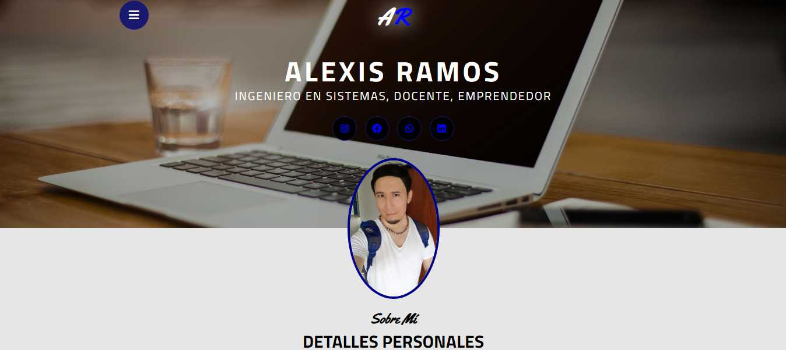
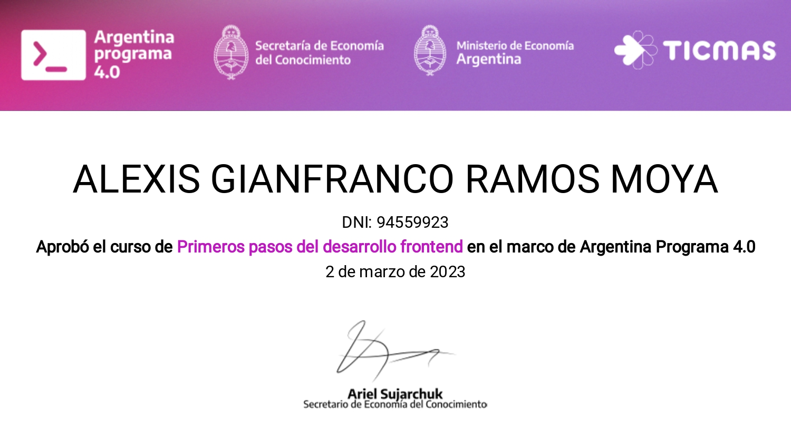

# Proyecto CV Online

Este proyecto es el resultado del curso "Primeros pasos en el desarrollo frontend" de Argentina Programa 4.0 dictado por Ticmas. Fue creado por Alexis Ramos como su proyecto final para el curso. El objetivo del proyecto es poner en práctica las habilidades adquiridas durante el curso.

## Características

- Diseño de una sola página
- 5 secciones: Inicio, Sobre mí, Habilidades, Resumen y Contacto
- Información detallada sobre las habilidades técnicas y experiencia laboral de Alexis
- Formulario de contacto para que los visitantes puedan comunicarse

## Instalación

1. Clona el repositorio: `git clone https://github.com/alexis-ramos-ok/ProyectoCV`
2. Navega hasta la carpeta del proyecto: `cd ProyectoCV`
3. Abre el archivo `index.html` en tu navegador web.

## Uso

1. En la sección de **Inicio**, encontrarás una breve introducción sobre el perfil.
2. En la sección de **Sobre mí**, podrás obtener más detalles relacionados al perfil de la persona del CV.
3. La sección de **Habilidades** destaca las habilidades principales y muestra el nivel de dominio en cada una de ellas.
4. En la sección de **Resumen**, encontrarás un resumen de la educación y experiencia laboral.
5. La sección de **Contacto** contiene datos para una comunicación directa con el perfil.

## Contacto

Si tienes alguna pregunta o sugerencia sobre el proyecto, no dudes en ponerte en contacto a través del siguiente correo electrónico: alexleaderhere@gmail.com.

## Certificado del Curso

